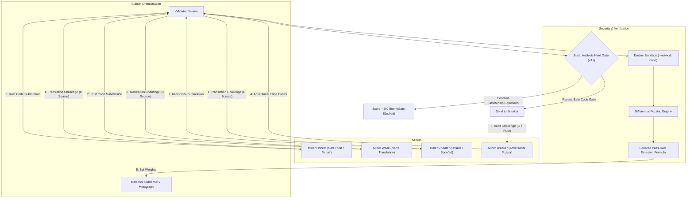

# Bittensor C-to-Safe-Rust Subnet (Adversarial Breaker Architecture)

An adversarial, production-ready Bittensor subnet that incentivizes AI miners to translate legacy C codebases into **100% Safe Rust** (forbidding `unsafe`, `build.rs`, `libc`, and process execution), while adversarial **"Breaker" miners** hunt for logic regressions, memory divergences, and runtime panics to claim slashing bounties.

---

## Architecture Overview



---

## Key Mechanism & Math

### 1. The Squared Pass-Rate Scoring Formula
$$\text{Base Score} = (\text{Differential\_Fuzz\_Pass\_Rate})^2$$
$$\text{Safety Penalty} = \begin{cases} 1.0 & \text{if 0 unsafe blocks} \\ 0.0 & \text{if unsafe blocks present (Hard Reject)} \end{cases}$$
$$\text{Speed Bonus} = \min\left(1.2, 1.0 + \frac{T_{\max} - T_{\text{actual}}}{T_{\max}} \times 0.2\right)$$
$$\text{Final Score} = \text{Base Score} \times \text{Safety Penalty} \times \text{Speed Bonus}$$

*Note: The speed bonus is strictly capped at $1.20$ to disincentivize miners from spoofing translations with an embedded C interpreter or C FFI.*

### 2. Dual Miner Roles
- **Translator Miner (`neurons/miner_translator.py`)**:
  - Translates legacy C code into pure Safe Rust (`#![forbid(unsafe_code)]`).
  - Employs an internal pre-submission self-repair loop to verify the absence of `unsafe` and syntax regressions before dispatching.
- **Breaker Miner (`neurons/miner_breaker.py`)**:
  - Adversarial fuzzer that examines C code and candidate Rust code to generate inputs that trigger divergences (null-byte boundaries, Unicode multibyte sequences, integer overflow points).
  - Earns lucrative bug bounties when catching translation flaws.

### 3. Strict Validator Sandboxing (`neurons/validator.py`)
- **Step 1 (Static Analysis Hard Gate)**: Rejects forbidden keywords (`unsafe`, `build.rs`, `std::process::Command`, `libc::`, `extern "C"`) in $< 1\text{ ms}$ with score $0.0$.
- **Step 2 (Sandboxed Compilation)**: Compiles untrusted code inside isolated containers (`--network none`, `--read-only`, non-root user).
- **Step 3 (Differential Fuzzing)**: Evaluates stdout byte-for-byte between the C binary and the Rust binary across 50–100 property-based hidden tests.

---

## Directory Structure

```text
bittensor-c2rust-subnet/
├── dataset/
│   ├── hidden_tests.py         # Hypothesis-driven adversarial property fuzzer
│   └── sample_c_code.c         # Benchmark C string/parser algorithm
├── neurons/
│   ├── miner.py                # Unified miner entrypoint (--type translator|breaker)
│   ├── miner_translator.py     # C-to-Safe-Rust translator miner with repair loop
│   ├── miner_breaker.py        # Adversarial edge-case generator
│   └── validator.py            # Hard gate, differential fuzzer & scoring neuron
├── protocol/
│   ├── __init__.py
│   └── protocol.py             # TranslationSynapse and BreakerSynapse
├── sandbox/
│   ├── Dockerfile              # Multi-stage secure compilation container
│   └── sandbox_runner.py       # Sandboxed execution coordinator
├── substrate/
│   └── __init__.py             # Real Bittensor SDK & high-fidelity mock fallback
├── scripts/
│   ├── run_demo.py             # 4-miner live hackathon demonstration
│   ├── run_demo.sh             # Bash runner for live demo
│   ├── verify_anti_cheat.py    # Static analysis and formula verification suite
│   └── verify_anti_cheat.sh    # Bash runner for anti-cheat suite
└── tests/
    ├── test_breaker.py         # Breaker adversarial generation unit tests
    ├── test_end_to_end.py      # Master CI/CD integration suite
    └── test_miner_translation.py # Safe Rust synthesis unit tests
```

---

## Verification & Execution Commands

### 1. Run Anti-Cheat Hard Gate Verification
Verifies that `unsafe`, C-interpreter spoofing, and `libc` backdoors are immediately rejected in $< 1\text{s}$ with a $0.0$ score:
```bash
python scripts/verify_anti_cheat.py
```

### 2. Run the Live 4-Miner Competition Demo
Spawns the local validator and 4 competing miners (`Honest`, `Weak`, `Cheater`, `Breaker`) over multiple rounds:
```bash
python scripts/run_demo.py --rounds 3
```

### 3. Run Full Automated CI/CD Test Suite
```bash
python tests/test_end_to_end.py
```
