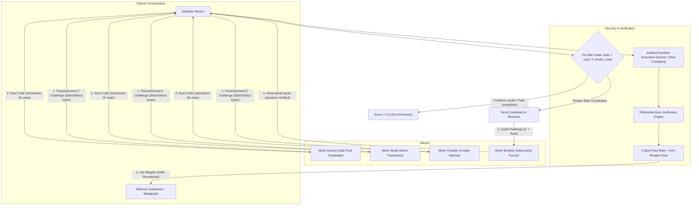

# Bittensor C-to-Safe-Rust Subnet (Adversarial Breaker Architecture)

An adversarial Bittensor subnet prototype that incentivizes AI miners to translate legacy C codebases into **100% Safe Rust** (enforced by `rustc -F unsafe_code`), while adversarial **"Breaker" miners** hunt for logic regressions, boundary divergences, and runtime panics to claim bug bounties.

---

## Architecture Overview



---

## Key Mechanism & Math

### 1. The Cubed Pass-Rate & 50% Breaker Scoring Formula

For a translator submission $t$:
- If candidate fails static pre-filter, fails `rustc -F unsafe_code` compilation, or exceeds source size limit (64 KB):
  $$\text{pre}_t = 0.0$$
- Otherwise, over secret sanitizer-checked hidden tests:
  $$\text{pre}_t = \left(\frac{\text{passed\_hidden}}{\text{total\_hidden}}\right)^3$$

*(Note: Speed bonuses are omitted to eliminate caching and precomputation gaming).*

### 2. Breaker Validity & The Anti-Collusion 50% Rule

Breaker miners submit raw byte inputs targeting edge cases.
- **Validity Criteria**: An input is valid if its size $\le 64\text{ KB}$ and it executes cleanly on the reference binary compiled with AddressSanitizer and UndefinedBehaviorSanitizer (`gcc -fsanitize=address,undefined`). Inputs that crash, time out, or trigger sanitizer diagnostics on C are rejected as invalid (preventing UB farming).
- **Breaking Condition**: A valid input where candidate Rust stdout bytes $\ne$ C reference stdout bytes, or candidate exit code $\ne$ C reference exit code.
- **The 50% Anti-Collusion Bounty**: If translator $t$ is broken by a set of unique breakers $B_t$:
  $$\text{Score}(t) = 0.0$$
  $$\text{Bounty}(b) = \frac{0.5 \times \text{pre}_t}{|B_t|} \quad \text{for each } b \in B_t$$
  
  *Game-theoretic guarantee*: If a translator deliberately plants a vulnerability and colludes with a breaker to claim it, the pair forfeits $\text{pre}_t$ while gaining only $0.5 \times \text{pre}_t$, resulting in a net loss of $-0.5 \times \text{pre}_t$. Collusion is strictly unprofitable.
- **Penalties**: Empty breaker responses yield $0.0$. Invalid (UB-triggering) inputs incur a penalty floored at $0.0$.

### 3. Dual Miner Roles
- **Translator Miner (`neurons/miner_translator.py`)**:
  - Translates legacy C code into pure Safe Rust (`#![forbid(unsafe_code)]`).
  - Reads stdin as raw bytes, writes stdout as raw bytes, returns an exit code.
  - Employs an internal pre-submission self-repair loop to verify the absence of `unsafe` and compilation errors before dispatching.
- **Breaker Miner (`neurons/miner_breaker.py`)**:
  - Adversarial fuzzer that examines C code and candidate Rust code to generate raw byte inputs that trigger divergences.
  - Pre-screened against AddressSanitizer and UndefinedBehaviorSanitizer to ensure validity.
  - Earns bug bounties under the 50% anti-collusion rule when catching translation flaws.

### 4. Strict Validator Sandboxing (`neurons/validator.py`)
- **Step 1 (Static Analysis Pre-filter & Compiler Gate)**: Pre-filters obvious forbidden patterns, then strictly enforces `#![forbid(unsafe_code)]` via `rustc -F unsafe_code` inside the compiler.
- **Step 2 (Sandboxed Compilation & Execution)**: Compiles untrusted code inside isolated containers (`--network none`, `--read-only`, `--tmpfs /tmp:rw,noexec,size=16m`, `--cap-drop ALL`, non-root user) or via `AEGIS_ALLOW_UNSANDBOXED=1` local compiler pipeline.
- **Step 3 (Differential Verification)**: Evaluates stdout byte-for-byte and exit codes between the C binary and the Rust binary across secret, sanitizer-checked hidden tests and breaker-submitted inputs.

---

## Directory Structure

```text
bittensor-c2rust-subnet/
├── dataset/
│   ├── hidden_tests.py         # Secret sanitizer-verified property test generator
│   └── tasks.py                # Parameterized UB-free C tasks pool
├── neurons/
│   ├── miner.py                # Unified miner entrypoint (--type translator|breaker)
│   ├── miner_translator.py     # C-to-Safe-Rust translator miner with repair loop
│   ├── miner_breaker.py        # Adversarial edge-case generator
│   ├── scoring.py              # Cubed pass-rate and 50% anti-collusion breaker logic
│   └── validator.py            # Hard gate, differential fuzzer & scoring neuron
├── protocol/
│   ├── __init__.py
│   └── protocol.py             # TranslationSynapse and BreakerSynapse (stdin/stdout bytes)
├── sandbox/
│   ├── Dockerfile              # Multi-stage secure compilation container
│   └── sandbox_runner.py       # Sandboxed execution coordinator (Docker or local compiler)
├── substrate/
│   └── __init__.py             # Real Bittensor SDK & high-fidelity mock fallback (--mock)
├── scripts/
│   ├── run_demo.py             # Live subnet demo with genuine execution results
│   ├── run_demo.sh             # Bash runner for live demo
│   ├── verify_anti_cheat.py    # Static analysis and formula verification suite
│   └── verify_anti_cheat.sh    # Bash runner for anti-cheat suite
└── tests/
    ├── test_breaker.py         # Breaker adversarial generation unit tests
    ├── test_end_to_end.py      # Master CI/CD integration suite
    ├── test_miner_translation.py # Safe Rust synthesis unit tests
    ├── test_sandbox.py         # Sandbox compilation, isolation, and byte I/O tests
    └── test_scoring.py         # 50% rule, anti-collusion, and weight assignment tests
```

---

## Verification & Execution Commands

### 1. Run Anti-Cheat Hard Gate Verification
Verifies that `unsafe`, C-interpreter spoofing, and `libc` backdoors are immediately rejected:
```bash
python scripts/verify_anti_cheat.py
```

### 2. Run the Live 4-Miner Competition Demo
Spawns the local validator and 4 competing miners (`Honest`, `Weak`, `Cheater`, `Breaker`) over multiple rounds:
```bash
python scripts/run_demo.py --rounds 3
```

### 3. Run Full Automated CI/CD Test Suite
```bash
python tests/test_end_to_end.py
```
