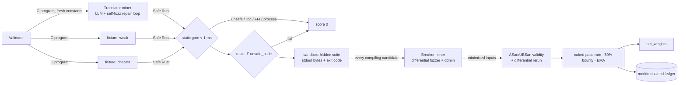

# Aegis — an adversarial Bittensor subnet for C → Safe Rust

> We don't ask an AI to write safe Rust. We pay a network of hackers to prove it wrong — and keep the translations nobody could break.

**Bittensor Global Subnet Hackathon** entry · [hackquest.io](https://www.hackquest.io/hackathons/Bittensor-Global-Subnet-Hackathon) · repo: [github.com/aryarakshit/aegis-subnet](https://github.com/aryarakshit/aegis-subnet)

`38 tests` · `8 C programs` · `4 LLM providers` · `Python 3.11+ · rustc · gcc/clang`

- [The problem](#the-problem)
- [The subnet](#the-subnet)
- [60-second demo](#60-second-demo)
- [What is real and what is mocked](#what-is-real-and-what-is-mocked)
- [Mechanism](#mechanism)
- [Task pool](#task-pool)
- [The dashboard](#the-dashboard)
- [Running the real miners](#running-the-real-miners)
- [Configuration](#configuration)
- [The dataset this produces](#the-dataset-this-produces)
- [Testnet](#testnet)
- [Roadmap](#roadmap)
- [Repository](#repository)
- [Tests](#tests)

---

## The problem

Legacy C runs the world's critical infrastructure and leaks memory-safety CVEs every week. Governments and vendors are
mandating migration to memory-safe languages, but automated C→Rust translators fail on exactly the inputs nobody thought to
test — an overlong UTF-8 sequence, a line one byte longer than the buffer, an overflow bit in the last byte of a varint. A
centralised "AI translation service" has no adversary: it can be overfit, it can be tricked, and it silently ships logic
regressions. Nobody is paid to find them.

## The subnet

Aegis makes finding them the most profitable thing on the network.

| Role | Incentive | What it actually does in this repo |
|---|---|---|
| **Translator miner** | Cubed pass-rate on hidden tests | Provider-agnostic LLM translation → static gate → `rustc -F unsafe_code` → **fuzzes its own output against the C oracle** → feeds the failing input back to the model → resubmits |
| **Breaker miner** | 50 % of a broken translator's forfeited score | Compiles the candidate, **runs a differential fuzzer against the C reference**, checks every hit under ASan/UBSan, **shrinks it with delta debugging**, submits the smallest reproducer |
| **Validator** | — | Static gate (< 1 ms) → sandboxed compile → byte-for-byte differential run on a secret suite → every candidate handed to every breaker → scoring → `set_weights` → **merkle-chained ledger commit** |

Three things make this different from "an LLM wrapper with a leaderboard":

1. **Both sides fuzz.** The translator red-teams itself before submitting; the breaker red-teams everyone else. Divergences
   are found by running programs, not by guessing.
2. **Every verdict is auditable.** The C source, every Rust submission and every breaking input are stored content-addressed
   and committed under a merkle root chained to the previous round. Anyone can re-verify the whole history offline.
3. **Collusion loses money.** A translator that plants a bug and "finds" it with a second hotkey forfeits its full score to
   collect half of it back.

Every number in the dashboard and demo comes out of a compiler. Nothing is scripted.

---

## 60-second demo

**Prerequisites:** Python 3.11+, `rustc` (rustup), and a C compiler exposed as `gcc` with sanitizer support (GCC or clang;
on Windows, llvm-mingw works and the gnullvm Rust target is detected automatically). Docker is optional.

```bash
pip install -r requirements.txt
python -m unittest discover -s tests     # 38 tests, ~3 min: every task, both miner roles, the gate, the ledger
python scripts/run_demo.py --rounds 3    # 1 validator, 3 translators, 1 breaker, real rounds
python server.py                         # http://127.0.0.1:8000 — watch a round stream live
```

For a live model, export a key first (any one of these): `ANTHROPIC_API_KEY`, `OPENAI_API_KEY`, `GEMINI_API_KEY`, `OLLAMA_HOST`.
Without credentials the LLM miner **replays recorded model output** from `dataset/llm_replay/` (provider, model, prompt hash and
timestamp are stored with every response) — it never falls back to a reference solution. Record your own set with
`python scripts/record_translations.py`; without a key and without recordings the `translator_llm` row reads "no submission".

What a round looks like (`run_demo.py`, `crc32`, model available):

```
[ROUND 1] task=crc32 {'poly': 3988292384}  hidden_tests=20  31.4s
  Bitwise CRC-32 with a per-round polynomial (shift/xor semantics)

  neuron               gate   rustc  hidden    pre_t    final    verdict
  translator_llm       PASS   ok     20/20     1.0000   1.0000   survived (2 attempt(s); self-test clean after 2 attempt(s))
  translator_weak      PASS   ok     20/20     1.0000   0.0000   BROKEN by ['breaker'] - reproducer 4097B b'XXXX…' (stdout mismatch)
  translator_cheater   REJECT -      -         0.0000   0.0000   Static Gate: 'unsafe' keyword detected
  breaker              -      -       24 valid          0.5000   bounty

  weights -> {'0': 0.666667, '1': 0.0, '2': 0.0, '3': 0.333333}
  ledger  -> height 1  root 78590d254746ab41c1e2…  prev 000000000000…
```

The weak translator passed all 20 hidden tests. The breaker read `const BUF_SIZE: usize = 4096;` in its Rust, probed the
boundary, and broke it with 4097 bytes. That is the whole thesis in one line.

---

## What is real and what is mocked

Judges should not have to guess.

| Component | Status |
|---|---|
| C reference compilation (`gcc -std=c11 -O2`) and sanitizer build (`-fsanitize=address,undefined`) | **Real** |
| Rust compilation with `rustc --edition 2021 -O -C overflow-checks=on -F unsafe_code` | **Real** |
| Differential execution, stdout byte + exit-code comparison | **Real** |
| Translator: LLM call, repair loop, self-differential-fuzz | **Real** (`neurons/llm.py`, `neurons/miner_translator.py`) — the miner has no import path to any reference solution; `tests/test_miner_translation.py::test_01` greps the source to enforce it |
| Breaker: static boundary analysis, mutation fuzzer, ASan/UBSan validity check, ddmin minimisation | **Real** (`neurons/difffuzz.py`, `neurons/miner_breaker.py`) |
| Scoring: cubed pass-rate, 50 % anti-collusion bounty, invalid-input penalty, EMA weights | **Real** (`neurons/scoring.py`) |
| Merkle-chained, content-addressed ledger of every round | **Real** (`neurons/ledger.py`, `scripts/verify_ledger.py`) |
| Docker sandbox (`--network none --read-only --cap-drop ALL --pids-limit 64 --memory 256m`) | **Implemented, not exercised in the demo** (`sandbox/Dockerfile`, `sandbox/sandbox_runner.py`); the demo and tests run on the host toolchain with `AEGIS_ALLOW_UNSANDBOXED=1`. Build with `docker build -t c2rust-sandbox sandbox/` and drop `--no_docker`. |
| `translator_weak` / `translator_cheater` | **Test fixtures** — deliberately flawed / `unsafe` submissions so the gate and breaker can be demonstrated deterministically. Labelled "fixture" everywhere. |
| Bittensor substrate (wallet, axon, dendrite, metagraph, `set_weights`) | **Mocked in-process** (`substrate/__init__.py`). The real SDK is used automatically when `bittensor` is installed and neither `--mock` nor `AEGIS_MOCK=1` is set. Not yet registered on testnet — see below. |

---

## Mechanism

**Translator score.** `pre_t = (passed_hidden / total_hidden)³`, or 0 if the static gate, `rustc -F unsafe_code`, or the 64 KB
source limit fails. Cubing makes 90 % correct worth 0.73 and 50 % worth 0.125: partial translations are not a business.

**Breaker bounty and the 50 % anti-collusion rule.** If translator *t* is broken by the set of breakers *B<sub>t</sub>*:
`score(t) = 0` and each breaker in *B<sub>t</sub>* receives `0.5 · pre_t / |B_t|`. A translator that plants a bug and
"finds" it with a second hotkey forfeits `pre_t` to gain `0.5 · pre_t`: collusion nets **−0.5 · pre_t**.

**Valid input.** A breaker input counts only if the ASan/UBSan build of the C reference finishes with no diagnostic, no crash
signal and no timeout. A **non-zero programmatic exit code is valid** — real programs report bad input that way and the
translation must reproduce it. Invalid inputs cost the breaker 0.05 each. (An earlier version treated every non-zero exit
as UB, which silently discarded the inputs that exercise error paths; the fix is covered by `tests/test_tasks.py`.)

**Hidden tests.** Fresh per round: structural boundary probes derived from the constants in the C source (n−1, n, n+1, 2n …),
plus seeded random byte fuzz, all pre-screened on the sanitizer build. Task constants change every round, so nothing can be cached.

**Static gate.** Sub-millisecond regex pre-filter for `unsafe`, `libc::`, `extern "C"`, `std::process::{Command,exit}`,
`std::fs::`, `asm!`, `build.rs` and `#![allow(unsafe_code)]`. `std::process::ExitCode` is allowed — it is the sanctioned way to
return a non-zero status. The gate is a fast path; the enforcement that matters is `rustc -F unsafe_code`.

**Weights.** `EMA_t = 0.9 · EMA_{t−1} + 0.1 · score_t`, normalised to Σ = 1, submitted with `set_weights`.

**Ledger.** Each round stores the C source, every Rust submission and every valid reproducer as `ledger/objects/<sha256>`,
writes a round record, and appends a merkle root chained to the previous root. `python scripts/verify_ledger.py` re-hashes
everything and fails on any edit.



---

## Task pool

Whole programs, stdin bytes → stdout bytes + exit code, all UB-free under ASan/UBSan, each with a per-round constant and a
planted-bug fixture that mirrors a real porting mistake.

| Task | Program | Per-round constant | Planted bug in the fixture |
|---|---|---|---|
| `base64_encode` | RFC 4648 encoder with line wrapping | `WRAP_COLS` | trailing newline when the last line is exactly full |
| `kv_normalize` | INI-style normaliser with a fixed line buffer (fgets semantics), exit 3 on bad header | `MAX_LINE` | ignores the buffer split; forgets `\r` is trimmed |
| `leb128_decode` | unsigned LEB128 decoder, `ERR`/`TRUNC` exit codes | `MAX_BITS` | accepts overflow bits in the last byte |
| `utf8_validate` | RFC 3629 validator, `BAD <offset>` / `LIMIT` exit codes | `MAX_POINTS` | accepts UTF-16 surrogates (`ED A0 80`) |
| `crc32` | bitwise CRC-32 | `POLY` | hashes only the first 4096 bytes |
| `fnv1a_lines` | FNV-1a per line | `OFFSET_BASIS`, `FNV_PRIME` | drops the last line without a newline |
| `rle_encode` | run-length encoder with a max run | `MAX_RUN` | counter wraps past the max |
| `reverse_bytes` | reverse fixed-size chunks | `CHUNK_SIZE` | reverses chars, not bytes |

Adding a task is one factory function in `dataset/tasks_extended.py` plus a registry line; `tests/test_tasks.py` proves the C is
sanitizer-clean, the reference Rust is byte-exact, and the fixture is genuinely catchable before it can be used.

---

## The dashboard

`python server.py` → http://127.0.0.1:8000. One page, Bauhaus black, four colours (ink, paper, red, grey): pass is a filled
block, failure is red, nothing else competes for attention.

| Panel | What it shows |
|---|---|
| **Dispatch a round** | pick a C program (or random), hidden-test count, optional seed; one button |
| **Live round** | four neuron cards updating from the validator's event stream: translate → gate → rustc → hidden → attack, with pre-score, final score and the miner's own notes |
| **Proof of break** | when a translator is broken: the reproducer as a hex dump, what C printed vs what Rust printed, exit codes, bytes shrunk from → to |
| **Terminal** | every validator, miner and sandbox log line as it happens |
| **Rounds** | history from `rounds.jsonl`; click a row for the full JSON record |
| **Ledger** | height, object count, head root; a button that recomputes every root in the browser |
| **Emissions** | on-chain weight per neuron, EMA, and a record (broken / gated / bounties) |
| **Gate** | paste Rust, see the pre-filter verdict and how many microseconds it took |

The page hydrates from the last completed round on load, so it is never empty after a demo. The backend is FastAPI with
Server-Sent Events; the same API is usable without the page:

| Endpoint | Purpose |
|---|---|
| `GET /api/status` | network, block, LLM mode, sandbox mode, ledger head |
| `POST /api/run-round` `{task_name, num_tests, seed}` | dispatch a round (409 if one is running) |
| `GET /api/events` | SSE stream of validator events and log lines |
| `GET /api/rounds`, `/api/rounds/{id}` | round history and full records |
| `GET /api/leaderboard` | per-neuron averages, EMA, on-chain weight |
| `GET /api/ledger`, `/api/ledger/verify`, `/api/ledger/round/{h}`, `/api/ledger/object/{sha256}` | chain, verification, records, raw artifacts |
| `GET /api/tasks`, `/api/task/{name}` | task pool and C source |
| `POST /api/check-gate` `{rust_code}` | the static gate, live |

---

## Running the real miners

```bash
# translator (any one provider)
export ANTHROPIC_API_KEY=...            # default model claude-opus-5; override with AEGIS_LLM_MODEL
python neurons/miner_translator.py --mode llm --wallet_hotkey my_translator --mock

# breaker (no model needed; --use_llm adds hypothesis inputs on top of the fuzzer)
python neurons/miner_breaker.py --fuzz_seconds 15 --wallet_hotkey my_breaker --mock

# validator
python neurons/validator.py --mock --no_docker      # drop --no_docker after `docker build -t c2rust-sandbox sandbox/`
```

Record model output for offline replay (writes `dataset/llm_replay/`, commit it):

```bash
ANTHROPIC_API_KEY=... python scripts/record_translations.py            # all 8 tasks × seeds 101, 202, 303
python scripts/record_translations.py --tasks utf8_validate --seeds 101
```

Audit a ledger you were handed:

```bash
python scripts/verify_ledger.py --ledger ./ledger --show 3
```

---

## Configuration

| Variable / flag | Where | Meaning |
|---|---|---|
| `ANTHROPIC_API_KEY` · `OPENAI_API_KEY` · `GEMINI_API_KEY` · `OLLAMA_HOST` | env | credentials; the first one found selects the provider |
| `AEGIS_LLM_PROVIDER` | env | force `anthropic` \| `openai` \| `gemini` \| `ollama` |
| `AEGIS_LLM_MODEL` | env | model id (defaults: `claude-opus-5`, `gpt-4o`, `gemini-2.0-flash`, `qwen2.5-coder:7b`) |
| `AEGIS_LLM_EFFORT` | env | Anthropic `output_config.effort` (`low` … `max`, default `high`) |
| `AEGIS_LLM_RECORD=1` · `AEGIS_LLM_REPLAY=1` | env | write / read `dataset/llm_replay/` (replay is automatic with no credentials) |
| `AEGIS_MOCK=1` or `--mock` | env / flag | in-process substrate instead of the real chain |
| `AEGIS_ALLOW_UNSANDBOXED=1` or `--no_docker` | env / flag | host toolchain instead of the Docker sandbox (dev only) |
| `AEGIS_ROUNDS_LOG` · `AEGIS_LEDGER_DIR` | env | where `server.py` writes the round log and ledger |
| `--max_repairs` · `--self_fuzz_seconds` | translator | LLM repair rounds; the miner's own red-team budget per draft |
| `--fuzz_seconds` · `--use_llm` | breaker | differential-fuzz budget per candidate; ask a model for hypothesis inputs first |
| `--translator_timeout` · `--breaker_timeout` | validator | seconds a miner may take (LLM rounds are slow by nature) |

---

## The dataset this produces

Every round leaves behind a tuple that is expensive to produce and impossible to fake: a C program, a Safe Rust translation, a
verdict, and — when it was broken — the minimal input that broke it, all under a merkle root anyone can recompute. Over time the
subnet accumulates exactly the training and evaluation data the next generation of code models needs: not "translations", but
translations paired with the adversarial cases that exposed the wrong ones. `ledger/` is that dataset; `scripts/verify_ledger.py`
is its proof of integrity.

---

## Testnet

The substrate layer is written against the `bittensor` SDK surface (`wallet`, `subtensor`, `metagraph`, `axon`, `dendrite`,
`set_weights`) and swaps in the real package automatically when it is importable and mock mode is not requested. The steps to go live:

```bash
pip install bittensor
btcli wallet new_coldkey --wallet.name aegis && btcli wallet new_hotkey --wallet.name aegis --wallet.hotkey validator
btcli subnet create --subtensor.network test               # or register on an existing test netuid
btcli subnet register --netuid <N> --subtensor.network test --wallet.name aegis --wallet.hotkey validator
python neurons/validator.py --netuid <N> --subtensor_network test --wallet_name aegis --wallet_hotkey validator
```

Not yet done at time of submission; everything above runs on the in-process mock with identical call shapes.

---

## Roadmap

- **Testnet registration** with one validator, one LLM translator and two breakers running unattended.
- **Docker sandbox exercised in CI** on Linux, then made the default.
- **Role discovery on a live metagraph**: probe each axon with both synapse types instead of attacking every serving neuron.
- **LLM-driven breakers** (`--use_llm`) benchmarked against the pure fuzzer on time-to-first-divergence.
- **Task pool growth**: functions lifted verbatim from real C libraries (musl, zlib, mbedTLS parsers) with the same
  stdin/stdout harness, and multi-file tasks.
- **Published dataset**: periodic ledger snapshots with reproducers, as the commodity the subnet exists to mint.

---

## Repository

```
dataset/
  tasks.py, tasks_extended.py   task pool (C, reference Rust, fixtures, per-round constants), registry, infer_task()
  fixtures.py                   weak/cheater test doubles - the only place fixtures are read
  hidden_tests.py               secret suite: structural boundary probes + seeded fuzz, sanitizer-screened
  llm_replay/                   recorded model output with provenance (created by scripts/record_translations.py)
neurons/
  llm.py                        provider-agnostic client (Anthropic SDK, OpenAI, Gemini, Ollama), record/replay
  difffuzz.py                   local differential fuzzer: seeds, mutations, ASan validity, ddmin
  miner_translator.py           LLM translator with self-red-team repair loop
  miner_breaker.py              adversarial breaker
  validator.py                  the round; emits structured events for the dashboard
  scoring.py                    cubed pass-rate, 50% bounty, penalties, EMA
  ledger.py                     content-addressed objects, merkle roots, chain, verify()
protocol/protocol.py            TranslationSynapse, BreakerSynapse (base64-safe over JSON)
sandbox/                        Dockerfile, sandbox runner (Docker or host toolchain), batch executor
substrate/                      real bittensor when available, high-fidelity mock otherwise
scripts/                        run_demo.py, record_translations.py, verify_ledger.py, verify_anti_cheat.py
server.py + templates/ + static/  FastAPI backend with SSE event stream; Bauhaus-black dashboard
tests/                          38 tests (see below)
```

## Tests

```bash
python -m unittest discover -s tests
```

`test_tasks` proves every task is sound before any miner is judged. `test_miner_translation` drives the LLM path with an
in-process model double that answers with a buggy draft first, so the repair loop has to do real work — and asserts the miner
source never references a reference solution. `test_breaker` requires the fuzzer to find the planted bug in each fixture, submit
only sanitizer-clean inputs, and shrink the reproducer. `test_ledger` tampers with a record and an object and expects
verification to fail. `test_llm` covers provider selection and record/replay. `test_end_to_end` runs a full round and checks
scores, weights, reproducers and the ledger commit. `test_sandbox` and `test_scoring` cover the differential runner and the
bounty arithmetic.
